# 🚂 Архитектура данных режимной карты (Mermaid-диаграмма)

```mermaid
%%{init: {'theme': 'base', 'themeVariables': {
  'fontSize': '16px',
  'primaryTextColor': '#000000',
  'primaryBorderColor': '#000000',
  'lineColor': '#000000',
  'tertiaryColor': '#ffffff'
}}}%%

graph TB
    %% Основной объект
    ROOT["RegimeMapRenderDataПолные данные для отрисовки режимной карты"]

    %% Ветвь 1: Метаданные
    ROOT --> META["metadata (объект)Метаинформация о расчете"]
    META --> META_PROPS["Обязательные поля:• id: string• name: string• createdAt: string (ISO)• updatedAt: string (ISO)"]

    %% Ветвь 2: Локомотивы
    ROOT --> LOCOS["locomotives[] (массив)Локомотивы в составе"]
    LOCOS --> LOCO_ITEM["Элемент массива (объект)"]
    LOCO_ITEM --> LOCO_PROPS["Обязательные поля:• id: string• series: string• position: number"]

    %% Ветвь 3: Вагоны
    ROOT --> CARS["cars[] (массив)Вагоны в составе"]
    CARS --> CAR_ITEM["Элемент массива (объект)"]
    CAR_ITEM --> CAR_PROPS["Обязательные поля:• id: string• series: string• weight: number (тонны)"]

    %% Ветвь 4: Координатная шкала
    ROOT --> RULER["coordinateRuler (объект)Система координат участка"]
    RULER --> RULER_PROPS["Обязательные поля:• startCoordinate: number (км)• endCoordinate: number (км)• adjustments: array"]
    RULER --> ADJUSTMENTS["adjustments[] (массив)Укороченные/удлинённые километры"]
    ADJUSTMENTS --> ADJ_ITEM["Элемент массива (объект)"]
    ADJ_ITEM --> ADJ_PROPS["Обязательные:• kilometer: number• actualLength: number (м)Опциональные:• reason: string"]

    %% Ветвь 5: Слои холста
    ROOT --> LAYERS["canvasLayers[] (массив)Вертикальное разбиение холста"]
    LAYERS --> LAYER_ITEM["Элемент массива (объект)"]
    LAYER_ITEM --> LAYER_PROPS["Обязательные:• position: number• heightPercent: number• hidden: booleanОпциональные:• name: string"]

    %% Ветвь 6: Профиль пути
    ROOT --> PROFILE["profile[] (массив)Профиль пути (уклоны)"]
    PROFILE --> PROF_ITEM["Элемент массива (объект)"]
    PROF_ITEM --> PROF_PROPS["Обязательные:• start: number (м)• end: number (м)• angle: number (‰)"]

    %% Ветвь 7: Станции
    ROOT --> STATIONS["stations[] (массив)Станции на участке"]
    STATIONS --> STAT_ITEM["Элемент массива (объект)"]
    STAT_ITEM --> STAT_PROPS["Обязательные:• name: string• coordinate: number (км)• graphical: GraphicalProperties"]
    STAT_ITEM --> STAT_GRAPH["graphical (объект)Графические свойства"]

    %% Ветвь 8: Ограничения скорости
    ROOT --> LIMITS["speedLimits[] (массив)Ограничения скорости"]
    LIMITS --> LIMIT_ITEM["Элемент массива (объект)"]
    LIMIT_ITEM --> LIMIT_PROPS["Обязательные:• start: number (км)• end: number (км)• limit: number (км/ч)• type: 'track_category' | 'custom' | 'temporary'"]

    %% Ветвь 9: Оптимальная кривая скорости
    ROOT --> OPT_CURVE["optimalSpeedCurve[] (массив)Оптимальная кривая скорости"]
    OPT_CURVE --> OPT_ITEM["Элемент массива (объект)"]
    OPT_ITEM --> OPT_PROPS["Обязательные:• distance: number (км)• speed: number (км/ч)• time: number (мин)"]

    %% Ветвь 10: Фактическая кривая скорости
    ROOT --> SPEED_CURVE["speedCurve[] (массив)Фактическая кривая скорости"]
    SPEED_CURVE --> SPEED_ITEM["Элемент массива (объект)"]
    SPEED_ITEM --> SPEED_PROPS["Обязательные:• distance: number (км)• speed: number (км/ч)• time: number (мин)"]

    %% Ветвь 11: Оптимальные режимы
    ROOT --> OPT_REGIME["optimalRegimeBands[] (массив)Режимы для оптимальной кривой"]
    OPT_REGIME --> OPT_REG_ITEM["Элемент массива (объект)"]
    OPT_REG_ITEM --> OPT_REG_PROPS["Обязательные:• start: number (км)• end: number (км)• mode: string"]

    %% Ветвь 12: Режимы локомотивов
    ROOT --> LOCO_REGIME["locomotiveRegimeBands[] (массив)Режимы для каждого локомотива"]
    LOCO_REGIME --> LOCO_REG_ITEM["Элемент массива (объект)"]
    LOCO_REG_ITEM --> LOCO_REG_PROPS["Обязательные:• locomotiveId: string• bands: RegimeBand[]"]
    LOCO_REG_ITEM --> LOCO_BANDS["bands[] (массив)Режимы данного локомотива"]
    LOCO_BANDS --> LOCO_BAND_ITEM["Элемент массива (объект)"]
    LOCO_BAND_ITEM --> LOCO_BAND_PROPS["Обязательные:• start: number (км)• end: number (км)• mode: string"]

    %% Ветвь 13: Продольные силы
    ROOT --> FORCES["longitudinalForces[] (массив)График продольных сил"]
    FORCES --> FORCE_ITEM["Элемент массива (объект)"]
    FORCE_ITEM --> FORCE_PROPS["Обязательные:• coordinate: number (м)• tension: number (кН) ≥ 0• compression: number (кН) ≥ 0"]

    %% Ветвь 14: Значки
    ROOT --> MARKS["marks[] (массив)Значки на карте"]
    MARKS --> MARK_ITEM["Элемент массива (объект)"]
    MARK_ITEM --> MARK_PROPS["Обязательные:• type: string• distance: number (м)• graphical: GraphicalPropertiesОпциональные:• label: string"]
    MARK_ITEM --> MARK_GRAPH["graphical (объект)Графические свойства"]

    %% Графические свойства (общие для станций и marks)
    STAT_GRAPH --> GRAPH_PROPS["GraphicalPropertiesОбязательные поля:• layerPosition: number• verticalPosition: number (px)• horizontalPosition: number (px)• fontSize: number (px)• fontColor: string (hex)• lineHeight: number (px)• rotation: number (°)• objectColor: string (hex)"]
    MARK_GRAPH --> GRAPH_PROPS

    %% Стилизация
    classDef required fill:#e1f5e1,stroke:#2e7d32,stroke-width:2px
    classDef optional fill:#e3f2fd,stroke:#1565c0,stroke-width:1px
    classDef array fill:#f3e5f5,stroke:#7b1fa2,stroke-width:2px
    classDef object fill:#fff3e0,stroke:#ef6c00,stroke-width:2px
    classDef shared fill:#fce4ec,stroke:#c2185b,stroke-width:2px

    class META_PROPS,LOCO_PROPS,CAR_PROPS,RULER_PROPS,LAYER_PROPS,PROF_PROPS,STAT_PROPS,LIMIT_PROPS,OPT_PROPS,SPEED_PROPS,OPT_REG_PROPS,LOCO_REG_PROPS,LOCO_BAND_PROPS,FORCE_PROPS,MARK_PROPS,ADJ_PROPS,GRAPH_PROPS required
    class LOCOS,CARS,ADJUSTMENTS,LAYERS,PROFILE,STATIONS,LIMITS,OPT_CURVE,SPEED_CURVE,OPT_REGIME,LOCO_REGIME,LOCO_BANDS,FORCES,MARKS array
    class ROOT,META,LOCO_ITEM,CAR_ITEM,RULER,ADJ_ITEM,LAYER_ITEM,PROF_ITEM,STAT_ITEM,LIMIT_ITEM,OPT_ITEM,SPEED_ITEM,OPT_REG_ITEM,LOCO_REG_ITEM,LOCO_BAND_ITEM,FORCE_ITEM,MARK_ITEM object
    class STAT_GRAPH,MARK_GRAPH,GRAPH_PROPS shared
```



## 📊 Условные обозначения

| Цвет              | Значение                         |
| ----------------- | -------------------------------- |
| 🟢 **Зелёный**    | Обязательные поля                |
| 🔵 **Синий**      | Опциональные поля                |
| 🟣 **Фиолетовый** | Массивы                          |
| 🟠 **Оранжевый**  | Объекты                          |
| 🔴 **Розовый**    | Общие/переиспользуемые структуры |

## 🎯 Ключевые особенности структуры

### 1. Разделение подвижного состава

- **Локомотивы** (`locomotives[]`) и **вагоны** (`cars[]`) хранятся отдельно
- Минимальный набор полей для каждого типа

### 2. Координатная шкала (`coordinateRuler`)

- Начальная и конечная координаты
- Массив исключений для нестандартных километров
- Эффективное хранение: пустой массив = все километры по 1000м

### 3. Слои холста (`canvasLayers[]`)

- Гибкое вертикальное разбиение
- Процентное распределение высоты
- Поддержка скрытия слоёв

### 4. Графические свойства (`GraphicalProperties`)

- Общая структура для станций и значков
- Полный контроль над позиционированием
- Привязка к слоям холста

### 5. Разделение режимов

- **Оптимальные режимы** (`optimalRegimeBands[]`) — для оптимальной кривой
- **Режимы локомотивов** (`locomotiveRegimeBands[]`) — индивидуальные для каждого локомотива

## 📏 Единицы измерения

| Параметр                            | Единица измерения    |
| ----------------------------------- | -------------------- |
| Координаты (distance, coordinate)   | **километры** (км)   |
| Длины (start, end в profile/forces) | **метры** (м)        |
| Скорость                            | **км/ч**             |
| Время                               | **минуты**           |
| Уклон                               | **промилле** (‰)     |
| Силы                                | **килоньютоны** (кН) |
| Вес                                 | **тонны** (т)        |
| Размеры на холсте                   | **пиксели** (px)     |
| Угол поворота                       | **градусы** (°)      |

## 🔗 Связи между сущностями

```
RegimeMapRenderData
├─ locomotives[].id ──→ locomotiveRegimeBands[].locomotiveId
│                       (связь локомотивов с их режимами)
│
├─ canvasLayers[].position ──→ GraphicalProperties.layerPosition
│                              (привязка объектов к слоям)
│
└─ coordinateRuler ──→ stations[].coordinate
                       speedLimits[].start/end
                       profile[].start/end
                       (единая система координат)
```

## 💡 Примеры использования

### Пример 1: Координатная шкала без аномалий

```json
{
  "coordinateRuler": {
    "startCoordinate": 1782.0,
    "endCoordinate": 1610.0,
    "adjustments": []
  }
}
```

**Интерпретация:** Все 172 километра имеют стандартную длину 1000м каждый.

### Пример 2: Координатная шкала с укороченными километрами

```json
{
  "coordinateRuler": {
    "startCoordinate": 1782.0,
    "endCoordinate": 1610.0,
    "adjustments": [
      {
        "kilometer": 1750,
        "actualLength": 950
      },
      {
        "kilometer": 1680,
        "actualLength": 1050
      }
    ]
  }
}
```

**Интерпретация:**

- 1750-й км укорочен на 50м (950м вместо 1000м)
- 1680-й км удлинён на 50м (1050м вместо 1000м)
- Остальные километры стандартные

### Пример 3: Слои холста

```json
{
  "canvasLayers": [
    { "position": 1, "heightPercent": 22.5, "hidden": false, "name": "Продольные силы" },
    { "position": 2, "heightPercent": 37.5, "hidden": false, "name": "Кривые скорости" },
    { "position": 3, "heightPercent": 20, "hidden": false, "name": "Профиль пути" },
    { "position": 4, "heightPercent": 20, "hidden": false, "name": "Режимы упрвления" }
  ]
}
```

**Интерпретация:**

- Холст разбит на 4 слоя
- Слой 2 (скорости) занимает наибольшую долю (37.5%)
- Все слои видимы

### Пример 4: Режимы локомотивов

```json
{
  "locomotiveRegimeBands": [
    {
      "locomotiveId": "loco-1",
      "bands": [
        { "start": 1782.0, "end": 1780.0, "mode": "T1" },
        { "start": 1780.0, "end": 1775.0, "mode": "Выбег" }
      ]
    },
    {
      "locomotiveId": "loco-2",
      "bands": [
        { "start": 1782.0, "end": 1779.0, "mode": "T2" },
        { "start": 1779.0, "end": 1774.0, "mode": "T1" }
      ]
    }
  ]
}
```

**Интерпретация:**

- У каждого локомотива свой набор режимов
