# 🚂 Архитектура данных режимной карты (Mermaid-диаграмма)

```mermaid
%%{init: {'theme': 'base', 'themeVariables': {
  'fontSize': '16px',
  'primaryTextColor': '#000000',
  'primaryBorderColor': '#000000',
  'lineColor': '#000000',
  'tertiaryColor': '#ffffff'
}}}%%

graph TB
    %% Основной объект
    ROOT["<b>RegimeMapRenderData</b><br/>Полные данные для отрисовки режимной карты"]

    %% Ветвь 1: Метаданные
    ROOT --> META["<b>metadata</b> (объект)<br/>Метаинформация о расчете"]
    META --> META_PROPS["<u>Обязательные поля:</u><br/><br/>• id: string<br/><br/>• name: string<br/><br/>• createdAt: string (ISO)<br/><br/>• updatedAt: string (ISO)"]

    %% Ветвь 2: Локомотивы
    ROOT --> LOCOS["<b>locomotives[]</b> (массив)<br/>Локомотивы в составе"]
    LOCOS --> LOCO_ITEM["<b>Элемент массива</b> (объект)"]
    LOCO_ITEM --> LOCO_PROPS["<u>Обязательные поля:</u><br/><br/>• id: string<br/><br/>• type: string<br/><br/>• position: number<br/><br/>• section: number"]

    %% Ветвь 3: Вагоны
    ROOT --> CARS["<b>cars[]</b> (массив)<br/>Вагоны в составе"]
    CARS --> CAR_ITEM["<b>Элемент массива</b> (объект)"]
    CAR_ITEM --> CAR_PROPS["<u>Обязательные поля:</u><br/><br/>• id: string<br/><br/>• type: string<br/><br/>• position: number<br/><br/>• weight: number (тонны)"]

    %% Ветвь 4: Координатная шкала
    ROOT --> RULER["<b>coordinateRuler</b> (объект)<br/>Система координат участка"]
    RULER --> RULER_PROPS["<u>Обязательные поля:</u><br/><br/>• startCoordinate: number (км)<br/><br/>• endCoordinate: number (км)<br/><br/>• adjustments: array"]
    RULER --> ADJUSTMENTS["<b>adjustments[]</b> (массив)<br/>Укороченные/удлинённые километры"]
    ADJUSTMENTS --> ADJ_ITEM["<b>Элемент массива</b> (объект)"]
    ADJ_ITEM --> ADJ_PROPS["<u>Обязательные:</u><br/><br/>• kilometer: number<br/><br/>• actualLength: number (м)"]

    %% Ветвь 5: Слои холста
    ROOT --> LAYERS["<b>canvasLayers[]</b> (массив)<br/>Вертикальное разбиение холста"]
    LAYERS --> LAYER_ITEM["<b>Элемент массива</b> (объект)"]
    LAYER_ITEM --> LAYER_PROPS["<u>Обязательные:</u><br/><br/>• position: number<br/><br/>• heightPercent: number<br/><br/>• hidden: boolean<br/><br/><u>Опциональные:</u><br/><br/>• name: string"]

    %% Ветвь 6: План пути
    ROOT --> TRACK_PLAN["<b>trackPlan[]</b> (массив)<br/>План пути (горизонтальные кривые)"]
    TRACK_PLAN --> PLAN_ITEM["<b>Элемент массива</b> (объект)"]
    PLAN_ITEM --> PLAN_PROPS["<u>Обязательные:</u><br/><br/>• start: number (м)<br/><br/>• end: number (м)<br/><br/><u>Опциональные:</u><br/><br/>• radius: number (м)<br/><br/>• direction: 'left' | 'right'"]

    %% Ветвь 7: Профиль пути
    ROOT --> PROFILE["<b>profile[]</b> (массив)<br/>Профиль пути (уклоны)"]
    PROFILE --> PROF_ITEM["<b>Элемент массива</b> (объект)"]
    PROF_ITEM --> PROF_PROPS["<u>Обязательные:</u><br/><br/>• start: number (м)<br/><br/>• end: number (м)<br/><br/>• angle: number (‰)"]

    %% Ветвь 8: Станции
    ROOT --> STATIONS["<b>stations[]</b> (массив)<br/>Станции на участке"]
    STATIONS --> STAT_ITEM["<b>Элемент массива</b> (объект)"]
    STAT_ITEM --> STAT_PROPS["<u>Обязательные:</u><br/><br/>• name: string<br/><br/>• coordinate: number (м)<br/><br/>• graphical: GraphicalProperties"]
    STAT_ITEM --> STAT_GRAPH["<b>graphical</b> (объект)<br/>Графические свойства"]

    %% Ветвь 9: Ограничения скорости
    ROOT --> LIMITS["<b>speedLimits[]</b> (массив)<br/>Ограничения скорости"]
    LIMITS --> LIMIT_ITEM["<b>Элемент массива</b> (объект)"]
    LIMIT_ITEM --> LIMIT_PROPS["<u>Обязательные:</u><br/><br/>• start: number (м)<br/><br/>• end: number (м)<br/><br/>• limit: number (км/ч)<br/><br/>• type: 'track_category' | 'custom' | 'temporary'"]

    %% Ветвь 10: Оптимальная кривая скорости
    ROOT --> OPT_CURVE["<b>optimalSpeedCurve[]</b> (массив)<br/>Оптимальная кривая скорости"]
    OPT_CURVE --> OPT_ITEM["<b>Элемент массива</b> (объект)"]
    OPT_ITEM --> OPT_PROPS["<u>Обязательные:</u><br/><br/>• distance: number (м)<br/><br/>• speed: number (км/ч)<br/><br/>• time: number (мин)"]

    %% Ветвь 11: Фактическая кривая скорости
    ROOT --> SPEED_CURVE["<b>speedCurve[]</b> (массив)<br/>Фактическая кривая скорости"]
    SPEED_CURVE --> SPEED_ITEM["<b>Элемент массива</b> (объект)"]
    SPEED_ITEM --> SPEED_PROPS["<u>Обязательные:</u><br/><br/>• distance: number (м)<br/><br/>• speed: number (км/ч)<br/><br/>• time: number (мин)"]

    %% Ветвь 12: Оптимальные режимы
    ROOT --> OPT_REGIME["<b>optimalRegimeBands[]</b> (массив)<br/>Режимы для оптимальной кривой"]
    OPT_REGIME --> OPT_REG_ITEM["<b>Элемент массива</b> (объект)"]
    OPT_REG_ITEM --> OPT_REG_PROPS["<u>Обязательные:</u><br/><br/>• start: number (м)<br/><br/>• end: number (м)<br/><br/>• mode: string"]

    %% Ветвь 13: Режимы локомотивов
    ROOT --> LOCO_REGIME["<b>locomotiveRegimeBands[]</b> (массив)<br/>Режимы для каждого локомотива"]
    LOCO_REGIME --> LOCO_REG_ITEM["<b>Элемент массива</b> (объект)"]
    LOCO_REG_ITEM --> LOCO_REG_PROPS["<u>Обязательные:</u><br/><br/>• locomotiveId: string<br/><br/>• bands: RegimeBand[]"]
    LOCO_REG_ITEM --> LOCO_BANDS["<b>bands[]</b> (массив)<br/>Режимы данного локомотива"]
    LOCO_BANDS --> LOCO_BAND_ITEM["<b>Элемент массива</b> (объект)"]
    LOCO_BAND_ITEM --> LOCO_BAND_PROPS["<u>Обязательные:</u><br/><br/>• start: number (м)<br/><br/>• end: number (м)<br/><br/>• mode: string"]

    %% Ветвь 14: Продольные силы
    ROOT --> FORCES["<b>longitudinalForces[]</b> (массив)<br/>График продольных сил"]
    FORCES --> FORCE_ITEM["<b>Элемент массива</b> (объект)"]
    FORCE_ITEM --> FORCE_PROPS["<u>Обязательные:</u><br/><br/>• coordinate: number (м)<br/><br/>• tension: number (кН) ≥ 0<br/><br/>• compression: number (кН) ≥ 0"]

    %% Ветвь 15: Значки
    ROOT --> MARKS["<b>marks[]</b> (массив)<br/>Значки на карте"]
    MARKS --> MARK_ITEM["<b>Элемент массива</b> (объект)"]
    MARK_ITEM --> MARK_PROPS["<u>Обязательные:</u><br/><br/>• type: string<br/><br/>• distance: number (м)<br/><br/>• graphical: GraphicalProperties<br/><br/><u>Опциональные:</u><br/><br/>• label: string"]
    MARK_ITEM --> MARK_GRAPH["<b>graphical</b> (объект)<br/>Графические свойства"]

    %% Графические свойства (общие для станций и marks)
    STAT_GRAPH --> GRAPH_PROPS["<b>GraphicalProperties</b><br/><br/><u>Обязательные поля:</u><br/><br/>• layerPosition: number<br/><br/>• coordinate: number (м)<br/><br/>• verticalPositionPercent: number (0-100%)<br/><br/>• fontSize: number (px)<br/><br/>• fontColor: string (hex)<br/><br/>• lineHeight: number (px)<br/><br/>• rotation: number (°)<br/><br/>• objectColor: string (hex)<br/><br/><u>Опциональные:</u><br/><br/>• horizontalOffset: number (px)"]
    MARK_GRAPH --> GRAPH_PROPS

    %% Стилизация
    classDef required fill:#e1f5e1,stroke:#2e7d32,stroke-width:2px
    classDef optional fill:#e3f2fd,stroke:#1565c0,stroke-width:1px
    classDef array fill:#f3e5f5,stroke:#7b1fa2,stroke-width:2px
    classDef object fill:#fff3e0,stroke:#ef6c00,stroke-width:2px
    classDef shared fill:#fce4ec,stroke:#c2185b,stroke-width:2px

    class META_PROPS,LOCO_PROPS,CAR_PROPS,RULER_PROPS,LAYER_PROPS,PLAN_PROPS,PROF_PROPS,STAT_PROPS,LIMIT_PROPS,OPT_PROPS,SPEED_PROPS,OPT_REG_PROPS,LOCO_REG_PROPS,LOCO_BAND_PROPS,FORCE_PROPS,MARK_PROPS,ADJ_PROPS,GRAPH_PROPS required
    class LOCOS,CARS,ADJUSTMENTS,LAYERS,TRACK_PLAN,PROFILE,STATIONS,LIMITS,OPT_CURVE,SPEED_CURVE,OPT_REGIME,LOCO_REGIME,LOCO_BANDS,FORCES,MARKS array
    class ROOT,META,LOCO_ITEM,CAR_ITEM,RULER,ADJ_ITEM,LAYER_ITEM,PLAN_ITEM,PROF_ITEM,STAT_ITEM,LIMIT_ITEM,OPT_ITEM,SPEED_ITEM,OPT_REG_ITEM,LOCO_REG_ITEM,LOCO_BAND_ITEM,FORCE_ITEM,MARK_ITEM object
    class STAT_GRAPH,MARK_GRAPH,GRAPH_PROPS shared
```



## 📊 Условные обозначения

| Цвет              | Значение                         |
| ----------------- | -------------------------------- |
| 🟢 **Зелёный**    | Обязательные поля                |
| 🔵 **Синий**      | Опциональные поля                |
| 🟣 **Фиолетовый** | Массивы                          |
| 🟠 **Оранжевый**  | Объекты                          |
| 🔴 **Розовый**    | Общие/переиспользуемые структуры |

## 🎯 Ключевые особенности структуры

### 1. Разделение подвижного состава

- **Локомотивы** (`locomotives[]`) и **вагоны** (`cars[]`) хранятся отдельно
- Минимальный набор полей для каждого типа

### 2. Координатная шкала (`coordinateRuler`)

- Начальная и конечная координаты
- Массив исключений для нестандартных километров
- Эффективное хранение: пустой массив = все километры по 1000м

### 3. Слои холста (`canvasLayers[]`)

- Гибкое вертикальное разбиение
- Процентное распределение высоты
- Поддержка скрытия слоёв

### 4. Графические свойства (`GraphicalProperties`)

- Общая структура для станций и значков
- **Горизонталь:** привязка к координатам пути (метры) + опциональное смещение (пиксели)
- **Вертикаль:** относительное позиционирование внутри слоя (0-100%)
- Привязка к слоям холста
- **Преимущества:**
  - ✅ Автоматическое масштабирование при зуме
  - ✅ Стабильное позиционирование при изменении размеров слоёв
  - ✅ Прямая связь с координатами пути

### 5. Разделение режимов

- **Оптимальные режимы** (`optimalRegimeBands[]`) — для оптимальной кривой
- **Режимы локомотивов** (`locomotiveRegimeBands[]`) — индивидуальные для каждого локомотива

## 📏 Единицы измерения

| Параметр                        | Единица измерения    |
| ------------------------------- | -------------------- |
| **ВСЕ координаты и расстояния** | **метры** (м)        |
| Скорость                        | **км/ч**             |
| Время                           | **минуты**           |
| Уклон                           | **промилле** (‰)     |
| Силы                            | **килоньютоны** (кН) |
| Вес                             | **тонны** (т)        |
| Размеры на холсте               | **пиксели** (px)     |
| Угол поворота                   | **градусы** (°)      |

## 🔗 Связи между сущностями

```
RegimeMapRenderData
├─ locomotives[].id ──→ locomotiveRegimeBands[].locomotiveId
│                       (связь локомотивов с их режимами)
│
├─ canvasLayers[].position ──→ GraphicalProperties.layerPosition
│                              (привязка объектов к слоям)
│
└─ coordinateRuler ──→ stations[].coordinate
                       speedLimits[].start/end
                       profile[].start/end
                       (единая система координат)
```

## 💡 Примеры использования

### Пример 1: Координатная шкала без аномалий

```json
{
  "coordinateRuler": {
    "startCoordinate": 1782.0,
    "endCoordinate": 1610.0,
    "adjustments": []
  }
}
```

**Интерпретация:** Все 172 километра имеют стандартную длину 1000м каждый.

### Пример 2: Координатная шкала с укороченными километрами

```json
{
  "coordinateRuler": {
    "startCoordinate": 1782.0,
    "endCoordinate": 1610.0,
    "adjustments": [
      {
        "kilometer": 1750,
        "actualLength": 950
      },
      {
        "kilometer": 1680,
        "actualLength": 1050
      }
    ]
  }
}
```

**Интерпретация:**

- 1750-й км укорочен на 50м (950м вместо 1000м)
- 1680-й км удлинён на 50м (1050м вместо 1000м)
- Остальные километры стандартные

### Пример 3: Слои холста

```json
{
  "canvasLayers": [
    { "position": 1, "heightPercent": 22.5, "hidden": false, "name": "Продольные силы" },
    { "position": 2, "heightPercent": 37.5, "hidden": false, "name": "Кривые скорости" },
    { "position": 3, "heightPercent": 20, "hidden": false, "name": "Профиль пути" },
    { "position": 4, "heightPercent": 20, "hidden": false, "name": "Режимы ведения" }
  ]
}
```

**Интерпретация:**

- Холст разбит на 4 слоя
- Слой 2 (скорости) занимает наибольшую долю (37.5%)
- Все слои видимы

### Пример 4: Режимы локомотивов

```json
{
  "locomotiveRegimeBands": [
    {
      "locomotiveId": "loco-1",
      "bands": [
        { "start": 1782000, "end": 1780000, "mode": "T1" },
        { "start": 1780000, "end": 1775000, "mode": "Выбег" }
      ]
    },
    {
      "locomotiveId": "loco-2",
      "bands": [
        { "start": 1782000, "end": 1779000, "mode": "T2" },
        { "start": 1779000, "end": 1774000, "mode": "T1" }
      ]
    }
  ]
}
```

**Интерпретация:**

- У каждого локомотива свой набор режимов
- Локомотив 1: сначала режим T1, затем выбег
- Локомотив 2: сначала режим T2, затем T1

### Пример 5: Графические свойства объектов

```json
{
  "stations": [
    {
      "name": "Кропачево",
      "coordinate": 1781800,
      "graphical": {
        "layerPosition": 2,
        "coordinate": 1781800,
        "horizontalOffset": 0,
        "verticalPositionPercent": 10,
        "fontSize": 12,
        "fontColor": "#000000",
        "lineHeight": 16,
        "rotation": 0,
        "objectColor": "#0000ff"
      }
    }
  ],
  "marks": [
    {
      "type": "brake_test",
      "distance": 1000,
      "label": "Проба тормозов",
      "graphical": {
        "layerPosition": 3,
        "coordinate": 1000,
        "horizontalOffset": -10,
        "verticalPositionPercent": 80,
        "fontSize": 10,
        "fontColor": "#ff0000",
        "lineHeight": 14,
        "rotation": -45,
        "objectColor": "#ff0000"
      }
    }
  ]
}
```

**Интерпретация:**

- **Станция "Кропачево":**
  - Привязана к координате 1781800м на пути
  - Размещена на слое 2 (кривые скорости)
  - Позиция: 10% от верха слоя
  - При зуме автоматически остаётся на своей координате
- **Значок "Проба тормозов":**
  - Привязан к координате 1000м на пути
  - Смещён влево на 10 пикселей для точности
  - Размещён на слое 3 (профиль пути)
  - Позиция: 80% от верха слоя (у низа)
  - Повёрнут на -45° для лучшей читаемости

**Преимущества системы координат:**

- ✅ Объекты автоматически масштабируются при зуме
- ✅ Изменение высоты слоя не ломает вертикальное позиционирование
- ✅ Прямая связь между данными пути и их визуализацией
- ✅ Точная настройка через `horizontalOffset` и `verticalPositionPercent`

## 🎨 Рендеринг графических объектов

### Алгоритм отрисовки

```typescript
function renderGraphicalObject(obj: Station | Mark, viewport: Viewport, layers: CanvasLayer[]) {
  const { graphical } = obj;

  // 1. ГОРИЗОНТАЛЬНАЯ ПОЗИЦИЯ
  // Конвертируем координату пути в экранную позицию
  const baseX = coordinateToScreenX(graphical.coordinate, viewport);

  // Применяем дополнительное смещение (если есть)
  const x = baseX + (graphical.horizontalOffset || 0);

  // 2. ВЕРТИКАЛЬНАЯ ПОЗИЦИЯ
  // Находим слой
  const layer = layers.find((l) => l.position === graphical.layerPosition);

  // Вычисляем границы слоя
  const layerTop = calculateLayerTop(layer, layers);
  const layerHeight = calculateLayerHeight(layer, viewport.height);

  // Позиция внутри слоя (процент)
  const y = layerTop + (layerHeight * graphical.verticalPositionPercent) / 100;

  // 3. ОТРИСОВКА
  ctx.save();
  ctx.translate(x, y);
  ctx.rotate((graphical.rotation * Math.PI) / 180);
  ctx.font = `${graphical.fontSize}px Arial`;
  ctx.fillStyle = graphical.fontColor;

  // Рисуем объект (иконка, текст и т.д.)
  drawObject(ctx, obj, graphical);

  ctx.restore();
}

function coordinateToScreenX(coordinate: number, viewport: Viewport): number {
  // Преобразование координаты пути (метры) в экранную позицию (пиксели)
  const relativePosition = coordinate - viewport.startCoordinate;
  return relativePosition * viewport.scale + viewport.offsetX;
}

function calculateLayerTop(layer: CanvasLayer, layers: CanvasLayer[]): number {
  // Сумма процентов всех предыдущих слоёв
  return layers
    .filter((l) => l.position < layer.position && !l.hidden)
    .reduce((sum, l) => sum + l.heightPercent, 0);
}

function calculateLayerHeight(layer: CanvasLayer, totalHeight: number): number {
  // Высота слоя в пикселях
  return (totalHeight * layer.heightPercent) / 100;
}
```

### Пример viewport

```typescript
interface Viewport {
  startCoordinate: number; // Начальная координата видимой области (метры)
  endCoordinate: number; // Конечная координата видимой области (метры)
  scale: number; // Пикселей на метр (zoom level)
  offsetX: number; // Горизонтальный сдвиг (pan)
  height: number; // Высота холста (пиксели)
}

// Пример: весь участок 1782км - 1610км на экране шириной 1920px
const viewport: Viewport = {
  startCoordinate: 1610000, // 1610 км
  endCoordinate: 1782000, // 1782 км
  scale: 1920 / 172000, // ~0.0112 px/м
  offsetX: 0,
  height: 1080,
};

// После зума x2 в центр экрана
const zoomedViewport: Viewport = {
  startCoordinate: 1653000, // Центр ±43 км
  endCoordinate: 1739000,
  scale: 1920 / 86000, // ~0.0223 px/м (в 2 раза больше)
  offsetX: 0,
  height: 1080,
};
```

### Преимущества на практике

#### 1. Зум и панорамирование

```typescript
// При зуме меняется только viewport — объекты пересчитываются автоматически
function zoom(factor: number) {
  viewport.scale *= factor;
  viewport.startCoordinate = ...;  // Пересчёт границ
  viewport.endCoordinate = ...;
  // ВСЕ объекты автоматически масштабируются! ✅
}
```

#### 2. Изменение размера слоя

```typescript
// Изменили высоту слоя с 30% на 40%
layer.heightPercent = 40;

// Объект на 50% слоя останется ровно посередине! ✅
// Не нужно пересчитывать позиции
```

#### 3. Адаптивность

```typescript
// При изменении размера окна
window.addEventListener('resize', () => {
  viewport.height = canvas.height;
  // Все объекты автоматически адаптируются! ✅
});
```
